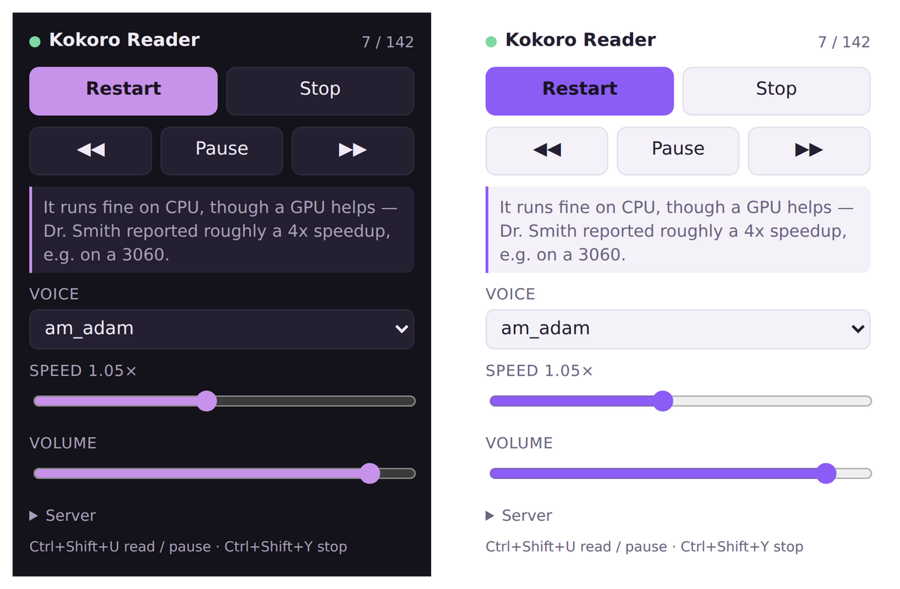

# Kokoro Reader

<p align="center">
  
</p>

A Firefox extension that reads web pages aloud using [Kokoro](https://huggingface.co/hexgrad/Kokoro-82M)
running locally on your own machine. No cloud TTS, no API keys, no telemetry — the page text
goes to `127.0.0.1` and nowhere else.

It extracts the article body (not the nav and footer), splits it into sentences, and
synthesizes the next few while the current one plays, so playback is continuous instead of
pausing between sentences.

```
Firefox extension  ──POST /tts──>  kokoro_server.py  ──>  Kokoro-82M
  extract.js     page text → chunks      local HTTP, WAV 24 kHz mono
  background.js  queue + prefetch + playback
```

**Two parts, both required:** the extension is the front end; the Python server does the
synthesis. The extension alone does nothing.

## Requirements

- Firefox 140+
- Python 3.10+
- ~400 MB disk for the model (downloaded once, automatically)
- `espeak-ng` installed system-wide (Kokoro falls back to it for unusual words)
  — `sudo dnf install espeak-ng` / `sudo apt install espeak-ng` / `brew install espeak-ng`
- A GPU is optional. CPU synthesis is roughly real-time; a GPU is comfortably faster.

## Install

### 1. The server

```bash
git clone https://github.com/fswolf/kokoro-reader.git
cd kokoro-reader/server
python3 -m venv .venv
.venv/bin/pip install -r requirements.txt
./start_server.sh
```

First start downloads the model and takes a minute. When it prints
`Kokoro reader server on http://127.0.0.1:8899` it's ready. Check it:

```bash
curl -s localhost:8899/health
```

Leave it running. If you'd rather not keep a terminal open, see
[Tray app](#tray-app) below, or the systemd unit at the bottom of this file.

### 2. The extension

Grab the signed `.xpi` from [Releases](https://github.com/fswolf/kokoro-reader/releases),
then in Firefox: `about:addons` → gear icon → **Install Add-on From File**.

<details>
<summary>Or load it from source (for development)</summary>

`about:debugging#/runtime/this-firefox` → **Load Temporary Add-on** → pick
`extension/manifest.json`. This version disappears when Firefox restarts.
</details>

## Use

| | |
|---|---|
| **Ctrl+Shift+U** | read page / pause / resume |
| **Ctrl+Shift+Y** | stop |
| Toolbar button | same, plus voice, speed and volume |
| Right-click a selection | *Read selection with Kokoro* |

The dot beside the popup title is green when the server is reachable. Changing voice or
speed re-synthesizes the current sentence immediately, so you can audition voices mid-page.

Default voice is `am_adam`. Also good: `am_michael`, `am_onyx`, `bm_george`, `bm_lewis`
(male), `af_bella`, `af_heart`, `bf_emma` (female). The popup lists whatever the server
reports.

## Tray app

Optional. `server/kokoro_tray.py` runs the server as a child process and puts it in the
system tray, so it starts from your app launcher instead of a terminal. The menu has a live
status line, start/stop/restart, test voice, and quit (which stops the server too).

```bash
sudo dnf install python3-gobject libayatana-appindicator-gtk3
# Debian/Ubuntu: sudo apt install python3-gi gir1.2-ayatanaappindicator3-0.1

cp server/kokoro-reader-tray.desktop ~/.local/share/applications/
update-desktop-database ~/.local/share/applications
```

Then launch "Kokoro Reader" from your launcher.

- The `.desktop` file assumes the repo is at `~/kokoro-reader`. Elsewhere, edit its `Exec=`
  line — and **quote the path if it contains spaces**, because `Exec` splits on whitespace
  and an unquoted path fails silently:
  `Exec=python3 "/home/you/My Projects/kokoro-reader/server/kokoro_tray.py"`
- On Wayland the tray is your bar's job: Waybar needs `"tray"` in `modules-right`, or the
  app runs but nothing draws the icon.
- `KOKORO_TRAY_AUTOSTART=0` starts the tray without starting the server.
- Nothing happens when launched? Run `python3 server/kokoro_tray.py` to see the error.

## macOS

Server and extension work the same. Three differences.

**Dependencies** via Homebrew:

```bash
brew install python espeak-ng
```

**No tray app** — `kokoro_tray.py` needs GTK and AppIndicator, which are Linux-only. Run
`server/start_server.sh` from Terminal, or start it at login with launchd:

```xml
<!-- ~/Library/LaunchAgents/local.kokoro-reader.plist -->
<?xml version="1.0" encoding="UTF-8"?>
<plist version="1.0">
<dict>
  <key>Label</key>            <string>local.kokoro-reader</string>
  <key>ProgramArguments</key> <array>
    <string>/Users/YOU/kokoro-reader/server/start_server.sh</string>
  </array>
  <key>RunAtLoad</key>        <true/>
  <key>KeepAlive</key>        <true/>
</dict>
</plist>
```

```bash
launchctl load ~/Library/LaunchAgents/local.kokoro-reader.plist
```

**Apple Silicon** — set `KOKORO_DEVICE=mps` in `start_server.sh` to use the GPU via Metal.
Leave it unset for CPU if torch complains.

## Configuration

Server, via env vars (set them in `server/start_server.sh`):

| Variable | Default | |
|---|---|---|
| `KOKORO_PORT` | `8899` | |
| `KOKORO_VOICE` | `am_adam` | default voice |
| `KOKORO_LANG` | `a` | `a` American, `b` British, plus others Kokoro supports |
| `KOKORO_DEVICE` | auto | set `cuda` to force GPU |
| `KOKORO_HOST` | `127.0.0.1` | leave it — see Security |

Extension, in the popup: voice, speed, volume, and the server URL.

## Tuning

- **Chunk size** — `MAX = 300` / `HARD = 420` in `extension/extract.js`. Smaller starts
  talking sooner but breaks prosody more often between sentences.
- **Lookahead** — `lookahead: 2` in `extension/background.js`. Each chunk in flight is one
  request; raise it on a GPU so synthesis stays ahead of playback.
- **Extraction misses the article** — `pickRoot()` scores candidates by paragraph text
  length with a link-density penalty and prefers `<article>`/`<main>`. Sites with unusual
  markup may need a selector added to the `explicit` query.
- **Abbreviations read as letters** — `protect()` hides dots inside `e.g.`, `U.S.`, `Dr.`,
  decimals and initials so the sentence splitter can't break them. Add cases to `ABBR`.

## Security

The server binds to `127.0.0.1` and has no authentication, which is fine for a loopback
socket. Don't change `KOKORO_HOST` to `0.0.0.0` on a shared or untrusted network — that
would let anyone on it synthesize arbitrary text on your machine.

The extension declares `data_collection_permissions: none` and means it: page text is
POSTed to your local server, nothing is stored, nothing leaves the machine.

## Known limitations

- Can't read PDFs or `about:` pages — Firefox doesn't allow script injection there.
- No word or sentence highlighting yet.
- Reads the whole extracted article from the top; no read-from-click-point.
- If the server logs `200` but you hear nothing, it's Firefox's autoplay policy on the
  background page — set `media.autoplay.default` to `0` in `about:config`.

## Run the server on login

```ini
# ~/.config/systemd/user/kokoro-reader.service
[Unit]
Description=Kokoro Reader TTS server

[Service]
ExecStart=%h/kokoro-reader/server/start_server.sh
Restart=on-failure

[Install]
WantedBy=default.target
```

```bash
systemctl --user enable --now kokoro-reader
```

## Building and signing

Firefox won't permanently install an unsigned add-on. To build your own signed copy, get
API credentials from [AMO](https://addons.mozilla.org/en-US/developers/addon/api/key/):

```bash
npm i -g web-ext
cd extension
export WEB_EXT_API_KEY='user:...' WEB_EXT_API_SECRET='...'
web-ext sign --channel=unlisted
```

## License

MIT — see [LICENSE](LICENSE).

Kokoro-82M is by [hexgrad](https://huggingface.co/hexgrad/Kokoro-82M), Apache 2.0.
